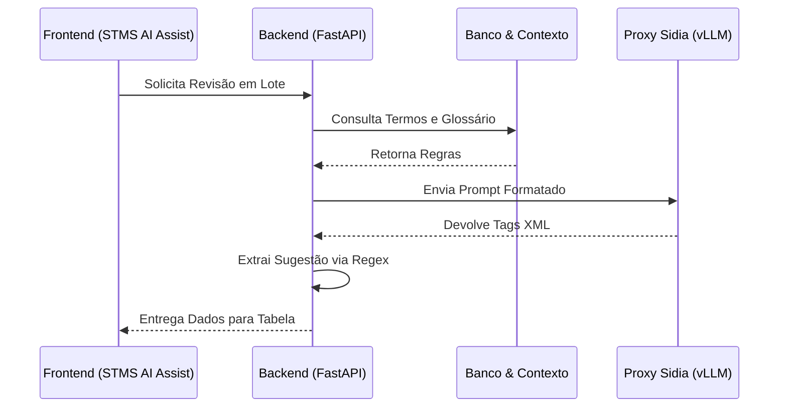
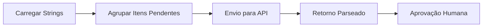

# Documentação Técnica: STMS AI Assist

Esta documentação descreve exclusivamente a ferramenta **STMS AI Assist** (assistente inteligente para suporte nas traduções via banco de dados) e o funcionamento da integração com a Inteligência Artificial (LLM) no backend.

---

## 1. Visão Geral da Arquitetura

O STMS AI Assist atua como uma interface de análise em lote para traduções armazenadas no banco de dados. O frontend fornece a listagem, os filtros e o motor de requisição paralela, enquanto o backend aplica regras de negócio corporativas e orquestra a chamada externa de IA.



---

## 2. Tecnologias de Desenvolvimento

As tecnologias abaixo englobam exclusivamente o escopo do STMS AI Assist no sistema:

### Frontend
- **React.js com Next.js:** Roteamento e arquitetura de componentes para a tela da ferramenta de banco de dados (`STMSDBTool`).
- **TypeScript:** Tipagem forte das interfaces, como status das strings (`pending`, `reviewing`, `approved`) e respostas da API (`AIReviewResponse`).
- **Tailwind CSS:** Construção fluida e responsiva da tabela de revisão, paginação e cores de status dinâmicas (Modo Escuro / Claro).
- **Lucide React:** Biblioteca responsável pela iconografia da ferramenta (botões de Approve, Reject, Lotes).

### Backend
- **FastAPI:** Framework Python assíncrono que expõe as rotas `/stms/strings` e as rotas de IA usadas pela ferramenta.
- **PostgreSQL (SQLAlchemy e psycopg2):** Orquestra o pool de conexões para resgatar as strings originais e auditar os metadados do glossário oficial da Samsung.
- **Requests:** Faz as interações RESTful contra o Proxy da IA corporativa.
- **Concurrent.futures (ThreadPoolExecutor):** Ferramenta do Python usada para paralelizar requisições massivas, avaliando 15 ou mais strings simultaneamente de modo não bloqueante.
- **Regular Expressions (re):** Engine nativa usada para limpar as alucinações textuais do LLM e recuperar somente os padrões de tag XML requeridos.

### Infraestrutura IA
- **Sidia OpenWebUI:** Proxy de interface de segurança corporativa que padroniza os pacotes e protege as chaves.
- **vLLM:** O motor que hospeda fisicamente e executa a inferência do modelo.

---

## 3. Interface e Fluxo no Frontend

O componente responsável por esta funcionalidade acessa a base de dados do sistema, exibe os itens traduzíveis em tabela e permite que a Inteligência Artificial faça a revisão técnica.

### Fluxo de Processamento

1. O usuário acessa a tabela de strings e filtra os registros (ex: apenas itens "Pending").
2. Ao iniciar o processo em lote, o frontend agrupa os itens (blocos de 15) e dispara para a API de revisão.
3. Após a resposta da API, o frontend injeta a "Sugestão" e o "Motivo" diretamente na linha da tabela.
4. O usuário aprova (Approve) ou rejeita (Reject) a sugestão da IA.



---

## 4. Partes do Código de IA (LLM)

A execução da IA no arquivo `server.py` segue um protocolo de restrições severas para garantir previsibilidade e precisão técnica para traduções complexas.

### 4.1 Configuração e Proxy Corporativo

O sistema se conecta a um proxy interno e por isso ignora a certificação SSL nativa (`verify=False`).

```python
PROXY_URL = "https://openwebui.sidia.org.br/api/chat/completions"
API_KEY   = 'API_KEY'
MODEL_ID  = "openai/gpt-oss-120b"
```

### 4.2 Leitura da Base de Conhecimento

Antes de montar o prompt, o sistema precisa ler os guias de estilo e o histórico de erros do usuário armazenados em arquivos de texto locais (pasta `knowledge_base/`).

**Leitura do Guia de Estilo (Tone of Voice):**
O backend lê o arquivo `tone_of_voice.txt` e fragmenta o documento em seções usando os marcadores `#`. Apenas as seções relevantes serão injetadas no prompt.

```python
kb_path = os.path.join(os.path.dirname(__file__), 'knowledge_base', 'tone_of_voice.txt')
with open(kb_path, 'r', encoding='utf-8') as f:
    content = f.read()

# Lógica interna fragmenta o content baseado nas hashtags '#' para extração cirúrgica
```

**Leitura de Feedbacks Anteriores:**
Para evitar que a IA repita correções inválidas que o analista já rejeitou, o sistema anexa os últimos 50 erros reportados diretamente do arquivo de feedback.

```python
# Injetar feedback de erros anteriores reportados pelo usuario
try:
    feedback_filename = f"feedback_{target_lang}.txt"
    feedback_path = os.path.join(os.path.dirname(__file__), 'knowledge_base', feedback_filename)
    if os.path.exists(feedback_path):
        with open(feedback_path, 'r', encoding='utf-8') as f:
            feedback_content = f.read().strip()
        if feedback_content:
            # Limitar para os últimos 50 feedbacks para não sobrecarregar o prompt (context window)
            feedback_entries = feedback_content.split("--- FEEDBACK")
            recent_entries = feedback_entries[-50:] if len(feedback_entries) > 50 else feedback_entries
            trimmed_feedback = "--- FEEDBACK".join(recent_entries).strip()
            
            # Concatena os feedbacks nas regras relevantes do LLM
            relevant_rules += f"\n\n[ERROS ANTERIORES REPORTADOS PELO USUÁRIO — NÃO REPITA ESTES ERROS:]\n{trimmed_feedback}\n"
except Exception as e:
    print(f"Aviso: Não foi possível carregar feedback: {e}")
```

### 4.3 Construção do System Prompt

Após filtrar as regras do `tone_of_voice.txt` e anexar os feedbacks, o backend constrói o contexto. A IA é proibida de responder fora das tags.

```python
# O System Prompt exige que a IA se comporte como Revisor Samsung e devolva APENAS tags XML
system_prompt = f"""Você é o Revisor de Tradução da SAMSUNG.
DIRETRIZES APLICÁVEIS PARA ESTA STRING:
{relevant_rules}

INSTRUÇÕES (LEIA COM ATENÇÃO):
- O idioma alvo da revisão é obrigatoriamente {lang_name}.
- Analise SEVERAMENTE o texto atual.
- Se a Regra de Ouro do Glossário estiver presente, ELA É SOBERANA.
- Responda EXATAMENTE neste formato XML: 
<advice>sugestão corrigida ou 'Mantido' se estiver perfeito</advice>
<reason>motivo detalhado da alteração</reason>
<simplyReason>resumo curto do erro. Retorne 'Correto' SOMENTE SE advice for 'Mantido'</simplyReason>
"""

# O texto do usuario recebe a string original e a atual que a IA deve auditar
user_content = f"Chave: {key} | Contexto: {design_type}\nEN: {en_content}\nPT: {pt_content}\n{glossary_hint}"

messages = [
    {"role": "system", "content": system_prompt},
    {"role": "user", "content": user_content}
]
```

### 4.4 Determinismo e Envio (Payload)

A chave para impedir que a Inteligência Artificial alucine ou faça resumos criativos é baixar o parâmetro `temperature` a um nível estrito.

```python
payload = {
    "model": model or MODEL_ID,
    "messages": messages,
    "temperature": 0.1,  # Impede variações criativas
    "stream": False
}

headers = {
    "Authorization": f"Bearer {API_KEY}",
    "Content-Type": "application/json"
}
```

### 4.5 Mecanismo de Retry da IA

Como a API externa pode enfrentar instabilidade durante avaliações massivas em lote, o backend conta com um laço de repetição com "backoff" (espera progressiva).

```python
max_retries = 3
for attempt in range(max_retries):
    try:
        response = requests.post(PROXY_URL, headers=headers, json=payload, verify=False, timeout=200)
        
        if response.status_code == 200:
            data = response.json()
            content = data["choices"][0]["message"]["content"]
            break # Sai do loop em caso de sucesso
            
        time.sleep(2 * (attempt + 1))  # Espera progressiva: 2s, 4s...
    except Exception as e:
        time.sleep(2 * (attempt + 1))
```

### 4.6 Extração XML e Trava de Segurança

Para garantir que a resposta não seja apenas texto livre, a saída bruta da IA é dissecada usando Expressões Regulares (Regex). Além disso, há uma trava lógica importante: se a IA sugeriu modificações no texto, ela é proibida de qualificar o texto original como "Correto" perante as regras gramaticais.

```python
# Disseca os nós da resposta da IA
match = re.search(
    r'<advice>(.*?)</advice>.*?<reason>(.*?)</reason>.*?<simplyReason>(.*?)</simplyReason>',
    content, re.DOTALL
)

if match:
    advice = match.group(1).strip()
    reason = match.group(2).strip()
    simply = match.group(3).strip()

    # Trava de alucinação: Corrige a métrica caso a IA diga que estava certo mas efetuou trocas
    if advice != "Mantido" and advice != pt_content:
        if simply.lower() in ["correto", "preciso", "ok", "perfeito"]:
            simply = "Alteração de formatação/pontuação"
```
